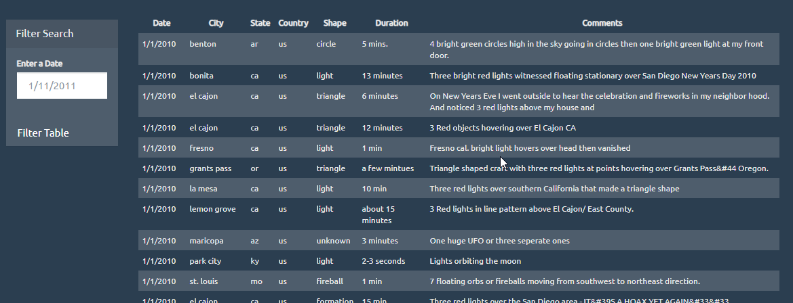
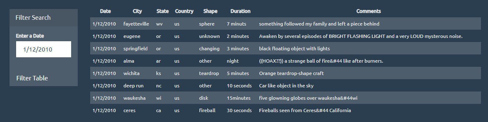
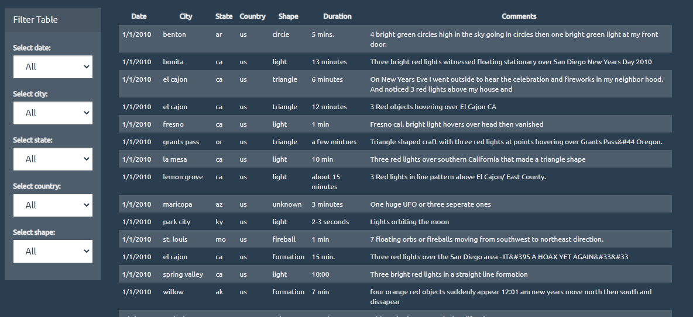
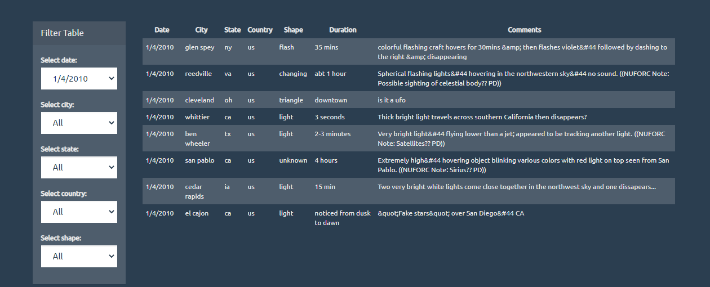
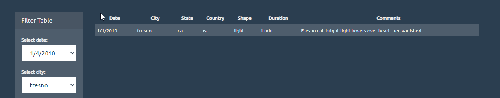
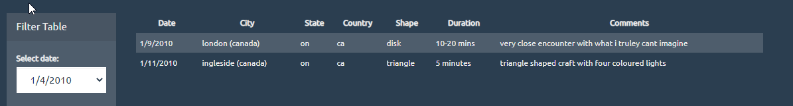

# JavaScript Homework - JavaScript and DOM Manipulation

## Background

WAKE UP SHEEPLE! The extra-terrestrial menace has come to Earth and we here at `ALIENS-R-REAL` have collected all of the eye-witness reports we could to prove it! All we need to do now is put this information online for the world to see and then the matter will finally be put to rest.

There is just one tiny problem though... our collection is too large to search through manually. Even our most dedicated followers are complaining that they are having trouble locating specific reports in this mess.

That's why we are hiring you. We need you to write code that will create a table dynamically based upon a [dataset we provide](StarterCode/static/js/data.js). We also need to allow our users to filter the table data for specific values. There's a catch though... we only use pure JavaScript, HTML, and CSS, and D3.js on our web pages. They are the only coding languages which can be trusted.

You can handle this... right? The planet Earth needs to know what we have found!

#UFO Level 1

For this part of the assignment I first created an init function to display the unfiltered table. Then, after entering a date the table updates to show only the sightings that take place on that date. 

 

#UFO Level 2
For level 2 of this assignment, I modified the filter to contain 5 sepearate drop down lists. The dropdowns are dynamically created based on the data in the data.js file. 

    var dates = [];
    //Get a Distinct list of Dates
    tableData.forEach(x => {
    if(!dates.includes(x.datetime)){
    //console.log(x.datetime);
    dates.push(x.datetime);
    }
    });
    
After getting the drop downs loaded, I created a filter function within the onchange function that took filters as long as the default "All" was not selected. 
    
    var filtered = tableData.filter(function(value) {
    if (shape !== "All" ) {
      console.log(shape);
      return value.shape === shape;
    }
    if (country !== "All" ) {
      console.log(country);
      return value.country === country;
    }
    if (state !== "All" ) {
      console.log(state);
      return value.state === state;
    }
    if (city !== "All" ) {
      console.log(city);
      return value.city === city;
    }  
    if (date !== "All") {
        console.log(date)
        return value.datetime === date;
      }
      else {
        return true;
      }
    })

After selecting the filters the table will update. If I had more time, I was working on getting the drop down lists to dynamically update after a fitler is selected so no errors present. Also, I could not get multi-filters even with appropriate selections to work. It appears that in our current D3 module there are better methods to update tables that I will apply in the future. 

